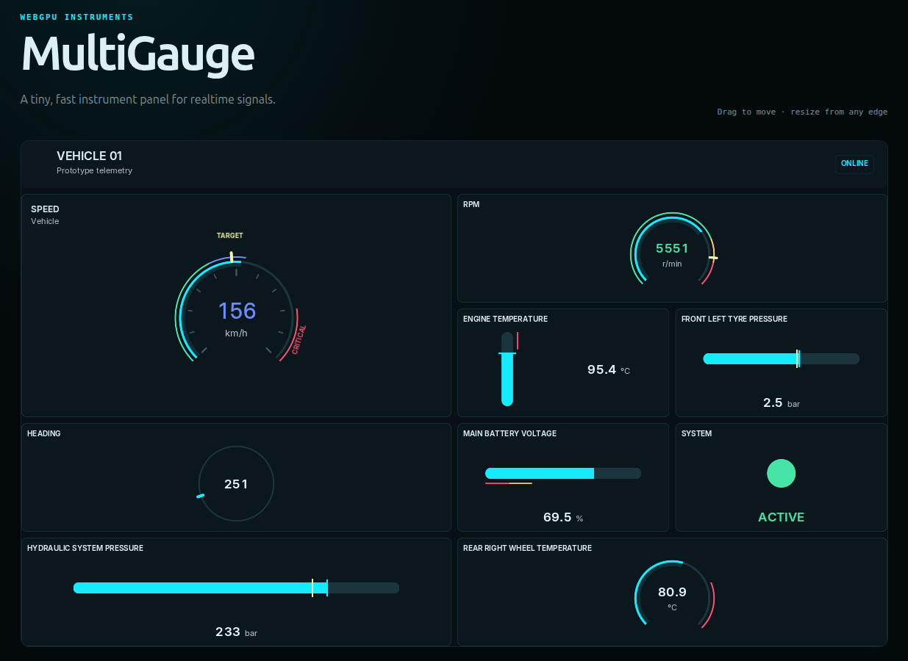

# MultiGauge

> A tiny, fast WebGPU instrument panel for realtime signals.

MultiGauge renders modern, dark telemetry panels directly with WebGPU. It is plain JavaScript ESM, has no runtime dependencies, draws only when something changes, and does not care where values come from.



```js
import { MultiGauge } from 'multi-gauge';

const panel = await MultiGauge.create(document.querySelector('canvas'), {
    grid: { rows: 2, columns: 3, gap: 8 },
    accent: '#00eaff',
    gauges: [
        {
            id: 'speed',
            type: 'arc',
            label: 'SPEED',
            min: 0,
            max: 300,
            unit: 'km/h',
            bands: [
                { from: 0, to: 160, kind: 'normal' },
                { from: 240, to: 300, kind: 'critical' }
            ],
            markers: [{ id: 'target', value: 145 }]
        },
        { id: 'heading', type: 'compass', label: 'HDG' },
        { id: 'radar', type: 'status', label: 'RADAR' }
    ]
});

panel.update({ speed: 127, heading: 182, radar: true });
```

## What it renders

- `arc`: scalar dial with configurable range, bands and markers.
- `linear`: horizontal or vertical, with `fill`, `marker`, or `fill-marker` mode.
- `compass`: cyclic dial; values wrap correctly around zero.
- `status`: discrete boolean, number or string states with semantic colors.

Bands are shared concepts across continuous gauge families. Arc, linear and compass bands can include a `label`, shown near the midpoint of the colored range when its measured text fits. Radial band labels sit close outside the arc with their baseline rotated along the midpoint tangent; labeled targets use a second, farther radial tier to avoid collisions. Status gauges use `states[].label` instead. `normal`, `warning`, `critical`, `inactive`, `target`, and custom theme keys remain separate from the panel accent.

Moving value indicators and progress tracks use the panel accent. Static key markers use `target` by default—or their configured semantic `kind`—and cross the gauge track with the same short-stroke language in linear and radial gauges. Numeric readouts use the regular text color outside bands and adopt the semantic color of the active band; units remain neutral.

Radial scale divisions use muted rounded strokes pointing toward the dial center. They scale with the dial and disappear below a useful radius. Arc endpoints and the midpoint are emphasized with slightly longer major ticks; compass cardinal positions remain reserved for `N`, `E`, `S`, and `W`.

Responsive radial layout prioritizes the dial itself. Band and target labels reserve an outer tier only when the complete text fits and the remaining dial keeps a useful radius; otherwise the label disappears without an ellipsis while the marker remains visible.

## Grid and header

Cells use `row`, `col`, `rowSpan`, and `colSpan`. Omit `row` and `col` to use deterministic auto-placement. A header is independent from the grid:

```js
const panel = await MultiGauge.create(canvas, {
    grid: { rows: 3, columns: 3 },
    header: {
        icon: new URL('./vehicle.svg', import.meta.url),
        title: 'VEHICLE 01',
        subtitle: 'Prototype',
        badge: 'ONLINE'
    },
    gauges: []
});
```

SVG, PNG and WebP header icons are decoded by browser APIs, uploaded once, and cached by URL in the shared GPU runtime. Text uses one shared GPU texture containing a small set of fixed Inter Variable raster styles. Smaller cells automatically reduce labels, ticks and secondary information.

## Runtime updates

```js
panel.set('speed', 130);
panel.update({ speed: 132, heading: 184 });
panel.setMarker('speed', 'target', 150);

panel.add({ id: 'temperature', type: 'linear', min: -40, max: 150 });
panel.remove('temperature');
```

Multiple updates in one browser frame produce one render. There is no permanent animation loop and no scheduler per gauge. Dynamic values are written through reusable staging memory; glyph buffers are rebuilt only when a formatted readout or its semantic color changes. Text measurements use a bounded atlas cache. All panels on a page share one `GPUDevice`, pipelines, glyph atlas and icon cache.

## Layout editing

```js
panel.move('speed', 0, 1);
panel.resize('speed', 2, 2);
panel.maximize('speed');
panel.restoreGauge('speed');
panel.minimize('speed');

panel.setEditing(false); // optionally disable direct manipulation
panel.setEditing(true);  // enable it again
```

Direct manipulation is enabled by default: drag anywhere inside a gauge to move it, or drag from any edge or corner to resize it. There is no edit mode or visible resize handle. Move and resize run as transactions: an outline follows the pointer, a placeholder shows the resolved grid destination, and the committed layout changes only on pointer release. Press `Escape` to cancel. Exact compatible footprints swap; other collisions use deterministic push/reflow. Failed operations leave the previous layout intact. The occupancy map—not the editor DOM—is the source of truth.

Arc and compass gauges use their complete content region and place the numeric value and unit on separate centered lines inside the dial. Compass headings use a moving perimeter mark instead of a center needle, leaving the middle available for the heading value. Horizontal linear gauges keep their readout below the bar; vertical linear gauges place value and unit on one line to the right so the bar can use the full available height. Labels are measured against the glyph atlas, reduced through 9–12 px UI buckets, and truncated with an ellipsis only when necessary. The bundled Inter Variable font is loaded before atlas generation; glyph styles are rasterized at the active `devicePixelRatio`, use real font metrics and snap text quads to the physical pixel grid. Numeric values use stable tabular advances without introducing a second font family.

## Persistence and lifecycle

```js
const json = JSON.stringify(panel.serialize());
panel.restore(JSON.parse(json));

console.log(panel.getStats());
panel.destroy();
```

Serialized state contains only public grid, layout, gauge, header and visual configuration. `destroy()` cancels pending work and releases canvas-specific GPU resources, observers, editor DOM and icon references; shared resources remain available to other panels.

WebGPU is required. MultiGauge fails with a clear `MultiGaugeError` rather than silently switching renderer.

## Development

```sh
npm test
npm run demo
```

Open `http://localhost:8080/demo/` for two simultaneous panels or `/benchmark/` for 1, 16, 64 and 100-gauge workloads at 10, 30 and 60 Hz. The benchmark also compares sixteen 1×1 panels with one 4×4 panel.

MultiGauge is source-agnostic: call `set()` or `update()` from WebSocket, SSE, sensors, shared memory, audio, simulations, or manual controls. Transport adapters belong outside this core package.
